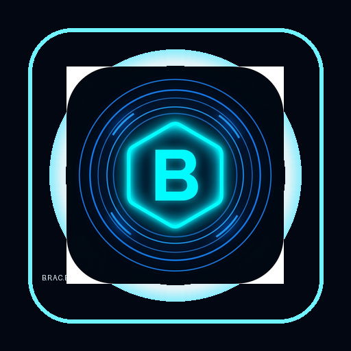

# B.R.A.C.E.

**Brain-like Responsive Assistant for Creation and Execution**

B.R.A.C.E. is a futuristic Python desktop AI command center for chat, voice, coding, automation, image generation, provider routing, diagnostics, local memory, and safe execution.



## Features

- PyQt6 command-center UI with dashboard, animated neural core, boot sequence, responsive navigation, telemetry, logs, and settings.
- Gemini Live voice/chat assistant with text input, microphone toggle, spoken response toggle, transcripts, and quick prompt chips.
- Jarvis-inspired daily assistant tools for greetings, current time/date, Wikipedia summaries, jokes, assistant renaming, local music playback, and note taking.
- Safe Mode by default for risky actions such as file writes/deletes, message sending, browser automation, system control, generated code, OpenClaw, and MCP process actions.
- Automation Center for browser control, web search, file control, code helper, desktop actions, YouTube tools, reminders, weather, screen processing, app launching, message sending, and more.
- Provider Router with Gemini, NVIDIA NIM/OpenAI-compatible API, local OpenAI-compatible servers, and OpenClaw gateway status hooks.
- Nano Banana Image Studio using direct Gemini image models, plus optional Nano Banana MCP server configuration.
- OpenClaw Control Center for detection, doctor, onboarding, gateway start/stop, and logs.
- MCP Server Manager for JSON validation, process start/stop, and secret-safe server config.
- Memory Vault, File Intelligence, Prompt Lab, Code Copilot, Web Intelligence, Diagnostics, Settings, API Key Vault, and About pages.
- Windows packaging with custom B.R.A.C.E. icon and PyInstaller build script.

## Screenshots

Add screenshots after running the upgraded app:

- Dashboard
- AI Chat
- Nano Banana Studio
- OpenClaw Control
- Diagnostics

## Tech Stack

- Python 3.11 or 3.12 recommended
- PyQt6
- Gemini Live / Google GenAI SDK
- Requests for OpenAI-compatible providers
- Playwright and PyAutoGUI for optional automation
- Optional Jarvis fallback libraries: pyttsx3, SpeechRecognition, wikipedia, and pyjokes
- PyInstaller for Windows executable builds

## Requirements

- Windows 10/11 recommended
- Python 3.11 or 3.12
- Microphone for voice workflows
- Node.js 24 recommended for OpenClaw, Node 22.14+ supported by current OpenClaw docs
- Gemini API key for chat/voice/image features
- NVIDIA API key only if using NVIDIA Build/NIM

## Setup

```cmd
python -m venv .venv
.venv\Scripts\activate
pip install -r requirements.txt
python -m playwright install
copy .env.example .env
```

Edit `.env` and add real keys. Never commit `.env`.

## Environment Variables

Important keys:

- `GEMINI_API_KEY`
- `NVIDIA_API_KEY`
- `OPENCLAW_GATEWAY_URL`
- `NANO_BANANA_MCP_PACKAGE`
- `LOCAL_AI_BASE_URL`
- `SAFE_MODE`
- `BRACE_ASSISTANT_NAME`
- `BRACE_MUSIC_DIR`
- `BRACE_NOTES_DIR`
- `BRACE_LEGACY_VOICE_ENABLED`
- `BRACE_LEGACY_STT_ENABLED`

See `.env.example` for the complete list.

## Running Locally

```cmd
python main.py
```

If no Gemini key is configured, the app opens safely and shows setup status instead of crashing.

## OpenClaw Setup

B.R.A.C.E. detects OpenClaw but does not install or run it without confirmation.

Current official flow:

```cmd
npm install -g openclaw@latest
openclaw onboard --install-daemon
openclaw gateway status
```

Gateway default: `http://127.0.0.1:18789`.

## Nano Banana MCP Setup

Direct Gemini image generation works through `GEMINI_API_KEY`. Optional MCP config lives in `config/mcp_servers.json`:

```json
{
  "mcpServers": {
    "nano-banana": {
      "enabled": false,
      "command": "npx",
      "args": ["-y", "${NANO_BANANA_MCP_PACKAGE}"],
      "env": {
        "GEMINI_API_KEY": "${GEMINI_API_KEY}"
      }
    }
  }
}
```

## NVIDIA API Setup

Set:

```env
NVIDIA_ENABLED=true
NVIDIA_API_KEY=your_nvidia_api_key_here
NVIDIA_BASE_URL=https://integrate.api.nvidia.com/v1
NVIDIA_DEFAULT_MODEL=paste_model_id_from_build_nvidia_com
```

Use the NVIDIA AI Hub page to test the key and model. B.R.A.C.E. does not hardcode model availability.

## Local AI Setup

For Ollama, LM Studio, LocalAI, or llama.cpp OpenAI-compatible servers:

```env
LOCAL_AI_ENABLED=true
LOCAL_AI_BASE_URL=http://localhost:11434/v1
LOCAL_AI_DEFAULT_MODEL=local-model-name
```

## Building `.exe`

```cmd
python build.py
```

Expected output:

```text
dist\BRACE.exe
```

or, if the spec is changed to one-folder mode:

```text
dist\BRACE\BRACE.exe
```

The build includes assets, config templates, version metadata, and the custom B.R.A.C.E. icon. It excludes `.env`, virtual environments, logs, outputs, build folders, and dist folders.

## Troubleshooting

- Missing modules: activate your virtual environment and run `pip install -r requirements.txt`.
- Playwright errors: run `python -m playwright install`.
- Microphone errors: check Windows privacy settings and `BRACE_VOICE_ENABLED`.
- Legacy voice fallback: enable `BRACE_LEGACY_VOICE_ENABLED` or `BRACE_LEGACY_STT_ENABLED`, then run Diagnostics to confirm optional packages and microphone access.
- Provider failure: use Provider Router or Diagnostics to test keys and endpoints.
- OpenClaw missing: install OpenClaw and rerun the OpenClaw check.
- MCP invalid: validate `config/mcp_servers.json` in MCP Server Manager.
- Icon still looks like Python: rebuild with `python build.py`, pin the new executable again, and clear stale Windows icon cache if needed.

## Security Notes

- Safe Mode is enabled by default.
- Real keys are read from `.env` and masked in the UI.
- Config JSON files store environment variable references only.
- Risky automation requires confirmation.
- Logs are redacted and should not contain secrets.

## Folder Structure

```text
actions/              Existing local automation modules
agent/                Existing planner/executor task system
automation/           Tool registry and safety metadata
config/               App, provider, and MCP configuration
integrations/         OpenClaw, MCP, Nano Banana services
memory/               Local memory manager and UI store wrapper
providers/            Provider routing and API wrappers
services/             Logging, settings, security, diagnostics, build helpers
assets/               Icons and logo
logs/                 Runtime logs, ignored by git
outputs/              Generated images and exports, ignored by git
tests/                Focused service tests
```

## Roadmap

- Full MCP protocol client invocation.
- Rich markdown/code rendering in chat.
- More provider adapters.
- Installer wizard and signed executable.
- Deeper automated UI tests.
